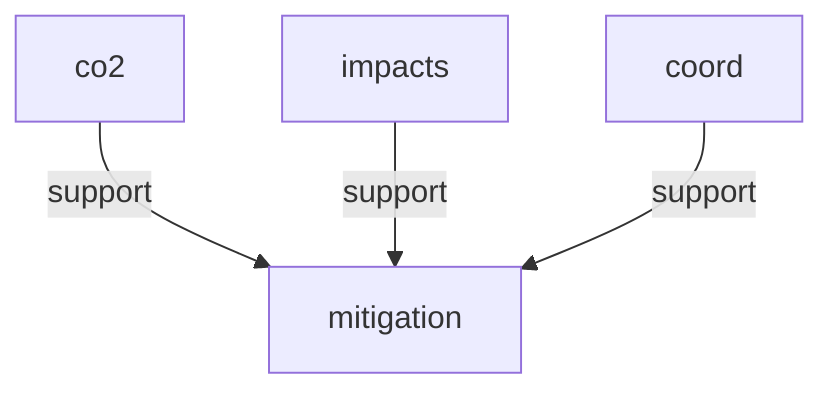

# argdown-2

A TypeScript parser and Mermaid renderer for the **Argdown Extended** argumentation markup language — single runtime dependency, mutation-tested to 80%+, spec-driven from [`docs/GRAMMAR.bnf`](docs/GRAMMAR.bnf).

> `argdown-2` is currently at **v0.1.0-alpha1**, private to this repository. The parser is **spec-complete** for the grammar specified in `docs/GRAMMAR.bnf`; the public API is frozen; the package is not yet published to npm. Distributed as GitHub Release tarballs; see [`CHANGELOG.md`](CHANGELOG.md) for the release history.

---

## The compiler pipeline

`->` links a fact (the named anchor) to the premises that support it. The lead example below is a 4-line argument map; what you see is what the parser produces.

**Source** — [`examples/lead.argdown`](examples/lead.argdown):

```argdown
[#co2] Human CO2 emissions are the primary cause { source: "@IPCC-AR6" }
[#impacts] Current warming trends threaten critical systems
[#coord] International coordination is achieved
([#mitigation]) -> [#co2], [#impacts], [#coord].
```

**AST** — typed plain data, every node tagged with `kind` and `loc`:

```json
{
  "kind": "Document",
  "elements": [
    { "kind": "FactStatement", "fact": { "ref": { "head": { "kind": "IdentifierHead", "identifier": "co2" } }, "claimText": "Human CO2 emissions are the primary cause", "attributes": { "entries": [/* { source: "@IPCC-AR6" } */] } }, "loc": { "start": { "line": 1, "column": 1, "offset": 0 }, "end": { "line": 1, "column": 64, "offset": 63 } } },
    { "kind": "Argument", "conclusion": { "kind": "atom", "value": { "head": { "kind": "IdentifierHead", "identifier": "mitigation" } } }, "premises": [/* atom co2, atom impacts, atom coord */], "loc": { "start": { "line": 4, "column": 1, "offset": 230 }, "end": { "line": 4, "column": 50, "offset": 279 } } }
  ],
  "loc": { "start": { "line": 1, "column": 1, "offset": 0 }, "end": { "line": 4, "column": 50, "offset": 279 } }
}
```

**Mermaid** — `flowchart TD` from `renderMermaid(document)`:



Three facts, three edges, one conclusion. If you reference `[#co2]` again later in the same document, it renders to the same `co2` node — that's the Ponytail Principle doing its work (see [Architecture](#architecture)).

---

## Status & rigor

**v0.0.0 means spec-complete, not unfinished.** The parser implements every production in [`docs/GRAMMAR.bnf`](docs/GRAMMAR.bnf) (~640 lines, every ambiguity resolved in a numbered `NOTE`). Legacy `:—` rule syntax from earlier drafts is a **hard parse error** — the lexer retains the token only to produce a clear migration message:

```
':—' syntax was removed. Use '->' for inference ([#A]) -> [#B], [#C].
```

**No backward-compat shims.** No deprecation aliases. The grammar is frozen.

**80%+ Stryker mutation score, enforced.** Every change to the parser is held to this threshold by `yarn mutate`. The test suite is not "passes examples" — it is "no mutant of the implementation can pass without changing tests."

**Validated against 7 fixture documents** in `src/parser.fixtures/`:

| Fixture | What it stresses |
| --- | --- |
| `small-claim.argdown` | A fact with a rich attribute block |
| `small-relation.argdown` | A single `-->x` relation |
| `small-rule.argdown` | A minimal argument chain |
| `medium-climate.argdown` | The worked climate-policy example from `docs/DESIGN.md` |
| `heavy-relations.argdown` | A 20-node dense graph |
| `deep-nesting.argdown` | Blocks within blocks within blocks |
| `large-stress.argdown` | 121 KB of mixed constructs |

If you want to verify the parser against the BNF, the fixture list is the most direct audit trail.

---

## Quick start

```ts
import { parse, formatError, renderMermaid } from '@casualtheorics/argdown-2';
import type { Document } from '@casualtheorics/argdown-2/ast';

const result = parse(source, { filename: 'example.argdown' });

if (!result.ok) {
  for (const err of result.errors) {
    console.error(formatError(err, 'example.argdown'));
  }
  if (result.partial) {
    // best-effort downstream output even on parse failure
    console.log(renderMermaid(result.partial));
  }
} else {
  console.log(renderMermaid(result.ast));
}
```

The `./ast` subpath exists so type-only consumers don't pull Chevrotain into their bundle:

```ts
import type { Document, FactStatement, Argument } from '@casualtheorics/argdown-2/ast';
```

**Solver API:** the package ships four grounded-extension solvers, each taking a parsed `Document` and returning a label map.

```ts
import { solve, solveBipolar, solveAspic, solveEvidential, renderMermaid } from '@casualtheorics/argdown-2';

// Method 1: Dung's grounded extension on a pure-attack reduction.
const dung = solve(parsed.ast);

// Method 2: Cayrol & Lagasquie-Schiex deductive-support reduction.
const bipolar = solveBipolar(parsed.ast);

// Method 3: ASPIC+ structured argumentation with preferences.
const aspic = solveAspic(parsed.ast);

// Method 4: Cayrol & Lagasquie-Schiex necessary-support reduction.
const evidential = solveEvidential(parsed.ast);

// All return { labels: Map<string, 'in' | 'out' | 'undec'>, warnings: string[] }.
// solveAspic additionally populates `defeats?: Map<string, string[]>`.
// The labels map flows directly into renderMermaid() to color winners/losers.
const mermaid = renderMermaid(parsed.ast, evidential.labels);
```

### `solveAspic(document): SolveResult`

Returns the same `SolveResult` shape as `solve()` and `solveBipolar()`,
plus an optional `defeats?: Map<string, string[]>` field that maps each
defeated argument key to the list of defeaters. Existing solvers return
`undefined` for `defeats`. The Mermaid renderer ignores `defeats`; it
is a programmatic-only field for callers that want to inspect the
defeat graph.

The ASPIC+ solver drops support (`-->`), equivalence (`<->`),
concession (`~>`), and qualification (`?>`) edges with a warning. To
make ASPIC+ do useful work, set `preference:` on the relevant facts
and arguments; otherwise rebut/undermine will not produce defeats.

**Untuned documents:** if a document has non-attack edges but no
`preference:` declared anywhere, the solver emits a warning explaining
that defeats will not derive from rebut/undermine until preferences
are set. ASPIC+ labels may then look like Dung's labels.

**Strict vs defeasible:** all argdown inference rules are defeasible
in v1. An undercut always defeats the targeted argument. Strict rules
(where undercut does not defeat) are a future cycle.

The `preference:` attribute sets a numeric preference on a fact or argument
for use with the ASPIC+ solver. Higher numbers mean "more preferred."
An attacker with strictly higher preference than its target produces a
defeat; tied preferences do not. The attribute is read by `solveAspic()`
and ignored by `solve()` and `solveBipolar()`. Default value is `0`.

```argdown
[#a] A fact { preference: 0.8 }
([#thesis]) -> [#a], [#b]. { preference: 0.6 }
```

**CLI:** install the latest tagged release directly from GitHub Releases (the package is not yet on npm):

```bash
echo '[#A] --> [#B]' \
  | npx https://github.com/kellenff/argdown-2/releases/download/v0.1.0-alpha1/casualtheorics-argdown-2-0.1.0-alpha1.tgz \
      render -
```

```bash
echo '[#A] --> [#B]' \
  | npx https://github.com/kellenff/argdown-2/releases/download/v0.1.0-alpha1/casualtheorics-argdown-2-0.1.0-alpha1.tgz \
      solve --semantics=bipolar -
```

The `argdown` binary reads stdin (or a filename argument; `-` is the stdin sentinel) and writes to stdout. Parse errors go to stderr with non-zero exit. Subcommands:

| Command | Action |
| --- | --- |
| `argdown render <file>` | Parse and write a Mermaid `flowchart TD` to stdout (default mode). |
| `argdown solve <file> [--semantics=X]` | Run a solver and write labels (grounded) or extension lists (multi-extension). |
| `argdown ast <file>` | Parse and dump the AST as JSON to stdout. |
| `argdown validate <file>` | Parse only — exit 0 on success, 1 on parse error, nothing on stdout. |
| `argdown format <file>` | Parse and emit the round-tripped source via `stringify`. |
| `argdown mcp` | Start an [MCP](https://modelcontextprotocol.io) (Model Context Protocol) server on stdio exposing `parse`, `validate`, `render_mermaid`, `solve`, and `format` as tools. |
| `argdown --help` / `--version` | Self-documenting. |

To pin a different release, substitute the tag and asset name in the URL
(they're the GitHub Release tag and the `npm pack` filename, respectively —
e.g. `v0.1.0` → `casualtheorics-argdown-2-0.1.0.tgz`).

**MCP server:** `argdown mcp` is the agent-friendly entry point. Wire it into Claude Desktop or any MCP host with a stdio transport and the host gets JSON-RPC tools for every CLI capability. Example host config:

```json
{
  "mcpServers": {
    "argdown": {
      "command": "npx",
      "args": [
        "https://github.com/kellenff/argdown-2/releases/download/v0.1.0-alpha1/casualtheorics-argdown-2-0.1.0-alpha1.tgz",
        "mcp"
      ]
    }
  }
}
```

The server registers 5 tools: `parse` (returns AST JSON or structured error list), `validate` (parse-only exit-code check), `render_mermaid` (Mermaid string), `solve` (one of 16 semantics, returns grounded labels or extension arrays), and `format` (round-tripped source). EOF on stdin or SIGTERM triggers a clean shutdown.

`--semantics=` values for `solve`:

- `dung` (default) | `bipolar` | `aspic` | `evidential` — grounded extension.
  - `dung` is the no-suffix default; `bipolar` is Method 2 (bipolar support, see Cayrol & Lagasquie-Schiex 2005 §3.2).
  - `aspic` is Method 3. Distinguishes rebut (`--x`), undercut (`-.->`), and undermine (`-.-`) attacks. Reads the `preference:` attribute to determine which attacks become defeats. Standard Modgil & Prakken 2014 dispute derivation.
  - `evidential` is Method 4. Cayrol & Lagasquie-Schiex 2005 §3.3: each `-->` is interpreted as "the supporter is necessary for the supported." A's defeat propagates to B (the opposite direction of bipolar's deductive reduction).

### Backward compatibility

The legacy `argdown-mermaid` binary name and the legacy flag form (`--solve`, `--semantics=…` without a subcommand) still work. The shim emits a one-time deprecation hint to stderr pointing at the new subcommand shape:

```bash
# Legacy (still works, prints "legacy flag form is deprecated" to stderr)
npx https://github.com/kellenff/argdown-2/releases/download/v0.1.0-alpha1/casualtheorics-argdown-2-0.1.0-alpha1.tgz argdown-mermaid --solve --semantics=bipolar doc.argdown
# New (preferred)
npx https://github.com/kellenff/argdown-2/releases/download/v0.1.0-alpha1/casualtheorics-argdown-2-0.1.0-alpha1.tgz argdown solve --semantics=bipolar doc.argdown
```

### Multi-Extension Semantics

For each of the four edge reductions, `argdown-2` ships three multi-extension semantics: preferred (maximal admissible sets), stable (admissible sets whose complement is fully attacked), and complete (admissible sets closed under defense). The 12 new `--semantics` values:

- `--semantics=preferred` (Dung)
- `--semantics=preferred-bipolar`, `preferred-aspic`, `preferred-evidential`
- `--semantics=stable`, `stable-bipolar`, `stable-aspic`, `stable-evidential`
- `--semantics=complete`, `complete-bipolar`, `complete-aspic`, `complete-evidential`

Output is a numbered list of extensions, each printed as the lex-sorted in-arg keys:

```
Extension 1: A, B, D
Extension 2: A, C, E
```

Programmatic API: 12 exported functions in the main module — see `solvePreferred`, `solveStable`, `solveComplete`, and their `<Reduction>`-suffixed siblings.

**Cross-validation invariant (Dung's theorem):** for any document, the intersection of all complete extensions equals the grounded extension. `solve(doc).labels.filter(l === 'in') === solveComplete(doc).extensions.reduce(intersect)`.

**Complexity (documented, not enforced):** preferred is Σ₂ᵖ-complete (worst-case O(3^(N/3)) extensions). Stable is NP-complete (worst-case O(2^N · N)). Complete is in P but worst-case O(2^N · N). For graphs larger than ~20 nodes, multi-extension can be slow — prefer the grounded solver for large documents.

**ASPIC+ multi-extension:** operates Dung's preferred/stable/complete fixpoint on the ASPIC+ defeat map (consistent with how ASPIC+ grounded uses Dung's fixpoint on the defeat graph).

**Mermaid:** not supported for multi-extension semantics. The CLI emits a stderr warning and falls back to the extension-list output.

**Example — same input, opposite labels:**

```argdown
[#A] First claim.
[#B] Second claim.
[#C] Objection.
[#A] --> [#B].
[#C] --x [#A].
```

- `--semantics=bipolar`: A `in`, B `in`, C `in`. Bipolar propagates B's defeat to A; here nobody defeats B, so nothing propagates and all three are winners.
- `--semantics=evidential`: A `out`, B `out`, C `in`. C defeats A directly; A's defeat propagates to B.

---

## Architecture

The codebase is laid out per grammar construct, with a clean CST→AST boundary and no Chevrotain types leaking past the public surface.

```
src/
├── index.ts              ← public API surface (parse, formatError, renderMermaid, types)
├── parser.ts             ← thin facade re-exporting per-construct parsers
├── tokens.ts             ← Chevrotain lexer (ArgdownLexer.tokenize)
├── parser-util.ts        ← TokenStream + helpers
├── parser-frontmatter.ts ← `===` YAML frontmatter
├── parser-fact.ts        ← `[#id] claim text { attrs }`
├── parser-relation.ts    ← `[#A] --> [#B] { ... }` (7-arrow taxonomy)
├── parser-arg.ts         ← `([#X]) -> [#Y], [#Z].`  (the cycle-2 addition)
├── parser-block.ts       ← `:::evidence[...] ... :::`
├── ast.ts                ← discriminated-union AST types (pure data, no runtime)
├── visitor*.ts           ← CST → AST transformers
├── mermaid.ts            ← pure AST → Mermaid `flowchart TD`
├── stringifier.ts        ← AST → source round-trip
├── cli.ts                ← top-level `argdown` dispatcher (argv → subcommand)
└── cli/                  ← one file per subcommand (render, solve, ast, validate, format, input, help)
```

### AST is plain data

Every node is a plain object with a discriminating `kind` literal and a mandatory `loc: SourceLocation`. No classes, no methods, no `this`. The AST round-trips through `JSON.stringify`. This is enforced by `src/ast.ts` and is the reason the `./ast` subpath can ship types-only.

### The `./ast` boundary

The parser internals (Chevrotain tokens, CST nodes, visitor helpers) are not re-exported from `./ast`. Type-only consumers import their types from there and never link Chevrotain. The runtime library pulls in Chevrotain; the type package doesn't.

### The Ponytail Principle

`renderMermaid()` does **content-keyed dedupe**: the same `FactHead` always renders to the same Mermaid node ID across the whole document. Two `[#co2]` references produce one node. This is a deliberate shortcut — a global `Map<string, string>` over `headKey(head)`, with synthetic IDs for disjunction premises. It is marked in source with a `ponytail:` comment naming the upgrade path (per-construct aliasing, if a future feature needs it).

The benefit is visible in the lead example: the same `co2` fact declared on line 1 is the same node that supports `mitigation` on line 4. No "co2", "co2_2", "co2 (1)" proliferation.

---

## Project status

**Current state (June 2026):**

- The parser is **feature-complete** for the language specified in `docs/GRAMMAR.bnf` (post-Cycle-2, which removed the `:-` rule syntax in favor of linked `->` arguments).
- The Mermaid renderer is a thin smoke test over the AST — it does what the parser produces, no more.
- The package is **`private: true` at `0.1.0-alpha1`**. Not yet published to npm; distributed as a GitHub Release tarball per `.github/workflows/release.yml`. See [`CHANGELOG.md`](CHANGELOG.md) for the release history.

**What's here:**

- Typed parser, typed AST, error recovery with partial-AST output
- CLI binary (`argdown`) with subcommands: `render`, `solve`, `ast`, `validate`, `format`, `mcp` (MCP server on stdio)
- 7-arrow relation taxonomy (`-->`, `--x`, `-.->`, `-.-`, `~>`, `?>`, `<->`)
- Linked-argument inference with multi-premise, disjunction, and nesting
- Unified `{}` attribute blocks (typed values: string, number, bool, null, flow-sequence, flow-mapping, plain scalar)
- Structured blocks (`:::evidence`, `:::stakeholder`, `:::meta`, `:::position`, `:::domain`)
- Frontmatter (`===`)
- Hard-error stance on legacy `:—` syntax

**What's deliberately not here:**

- **Argdown 1.x migration tooling** — the `:-` syntax is rejected, not translated. A separate `argdown-migrate` package would be the right home for this.
- **Datalog/argument evaluator** — the AST supports it; nothing queries it yet.
- **DOT/D2 renderer** — Mermaid is the smoke test; alternative renderers are independent packages.
- **Editor plugin / Language Server** — feasible via the `./ast` boundary; not built.
- **Mutation testing in CI** — `yarn mutate` is local-only; it's slow and orthogonal to "is this safe to release." The CI workflow runs `lint`, `format:check`, `typecheck`, `test`, and `build` per `.github/workflows/release.yml`.

**Spec conformance vs. parser extensibility:** the grammar is frozen and the `./ast` boundary is hard. Downstream developers cannot extend the language (custom tokens, plugin tokens, custom relation types) without forking the repository. This is a deliberate scoping decision, not an oversight.

---

## Development

```bash
yarn install        # Yarn 4 with PnP — .pnp.cjs and .pnp.loader.mjs are tracked
yarn build          # tsc → dist/
yarn typecheck      # tsc --noEmit
yarn lint           # oxlint
yarn format:check   # oxfmt --check
yarn test           # vitest
yarn bench          # tinybench, 7 fixtures
yarn bench:check    # compare against perf-baseline.json
yarn mutate         # Stryker, 80%+ threshold
```

See [`docs/DESIGN.md`](docs/DESIGN.md) for the language specification and [`docs/GRAMMAR.bnf`](docs/GRAMMAR.bnf) for the authoritative grammar.

## Cutting a release

Releases are produced by `.github/workflows/release.yml` on every push to
`main` whose `package.json` `version` differs from `HEAD~1`. To cut a
release:

1. Edit `package.json` and bump `version` to the new tag (e.g. `0.1.0`,
   `0.1.0-alpha2`, `1.0.0`).
2. Add a `## [<version>] - <YYYY-MM-DD>` section to `CHANGELOG.md`. The
   workflow fails the job if this section is missing — release notes are
   required, not optional.
3. Open a PR; merge into `main`.

The workflow runs `yarn install --immutable`, `yarn lint`, `yarn format:check`,
`yarn typecheck`, `yarn test`, then `yarn build`, then `npm pack`. It
extracts the matching section from `CHANGELOG.md` and publishes a GitHub
Release at tag `v<version>` with the tarball as the asset. On re-run, any
existing tag and release at the same version are deleted and recreated
idempotently. To publish without a version bump (e.g. to fix release notes
on an already-published tag), trigger the workflow manually via the
"Run workflow" button with an explicit `version` input.

## License

Private — not yet released. The license will be chosen before the first public release.
