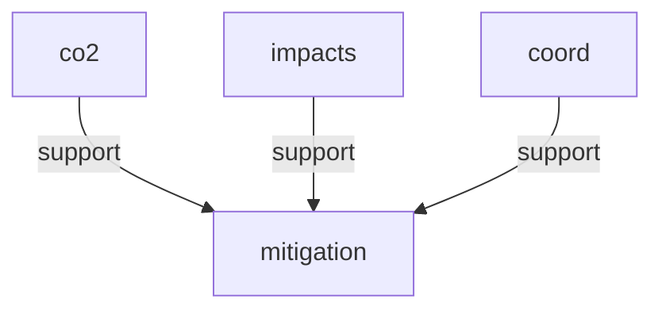

# argdown-2

A TypeScript parser and Mermaid renderer for the **Argdown Extended** argumentation markup language — single runtime dependency, mutation-tested to 80%+, spec-driven from [`docs/GRAMMAR.bnf`](docs/GRAMMAR.bnf).

> `argdown-2` is currently at **v0.0.0**, private to this repository. The parser is **spec-complete** for the grammar specified in `docs/GRAMMAR.bnf`; the public API is frozen; the package is not yet published to npm.

---

## The compiler pipeline

`->` links a fact (the named anchor) to the premises that support it. The lead example below is a 4-line argument map; what you see is what the parser produces.

**Source** — [`examples/lead.argdown`](examples/lead.argdown):

```argdown
[#co2] Human CO2 emissions are the primary cause { source: "@IPCC-AR6" }
[#impacts] Current warming trends threaten critical systems
[#coord] International coordination is achieved
([#mitigation]) -> [#co2], [#impacts], [#coord].
```

**AST** — typed plain data, every node tagged with `kind` and `loc`:

```json
{
  "kind": "Document",
  "elements": [
    { "kind": "FactStatement", "fact": { "ref": { "head": { "kind": "IdentifierHead", "identifier": "co2" } }, "claimText": "Human CO2 emissions are the primary cause", "attributes": { "entries": [/* { source: "@IPCC-AR6" } */] } }, "loc": { "start": { "line": 1, "column": 1, "offset": 0 }, "end": { "line": 1, "column": 64, "offset": 63 } } },
    { "kind": "Argument", "conclusion": { "kind": "atom", "value": { "head": { "kind": "IdentifierHead", "identifier": "mitigation" } } }, "premises": [/* atom co2, atom impacts, atom coord */], "loc": { "start": { "line": 4, "column": 1, "offset": 230 }, "end": { "line": 4, "column": 50, "offset": 279 } } }
  ],
  "loc": { "start": { "line": 1, "column": 1, "offset": 0 }, "end": { "line": 4, "column": 50, "offset": 279 } }
}
```

**Mermaid** — `flowchart TD` from `renderMermaid(document)`:



Three facts, three edges, one conclusion. If you reference `[#co2]` again later in the same document, it renders to the same `co2` node — that's the Ponytail Principle doing its work (see [Architecture](#architecture)).

---

## Status & rigor

**v0.0.0 means spec-complete, not unfinished.** The parser implements every production in [`docs/GRAMMAR.bnf`](docs/GRAMMAR.bnf) (~640 lines, every ambiguity resolved in a numbered `NOTE`). Legacy `:—` rule syntax from earlier drafts is a **hard parse error** — the lexer retains the token only to produce a clear migration message:

```
':—' syntax was removed. Use '->' for inference ([#A]) -> [#B], [#C].
```

**No backward-compat shims.** No deprecation aliases. The grammar is frozen.

**80%+ Stryker mutation score, enforced.** Every change to the parser is held to this threshold by `yarn mutate`. The test suite is not "passes examples" — it is "no mutant of the implementation can pass without changing tests."

**Validated against 7 fixture documents** in `src/parser.fixtures/`:

| Fixture | What it stresses |
| --- | --- |
| `small-claim.argdown` | A fact with a rich attribute block |
| `small-relation.argdown` | A single `-->x` relation |
| `small-rule.argdown` | A minimal argument chain |
| `medium-climate.argdown` | The worked climate-policy example from `docs/DESIGN.md` |
| `heavy-relations.argdown` | A 20-node dense graph |
| `deep-nesting.argdown` | Blocks within blocks within blocks |
| `large-stress.argdown` | 121 KB of mixed constructs |

If you want to verify the parser against the BNF, the fixture list is the most direct audit trail.

---

## Quick start

```ts
import { parse, formatError, renderMermaid } from '@casualtheorics/argdown-2';
import type { Document } from '@casualtheorics/argdown-2/ast';

const result = parse(source, { filename: 'example.argdown' });

if (!result.ok) {
  for (const err of result.errors) {
    console.error(formatError(err, 'example.argdown'));
  }
  if (result.partial) {
    // best-effort downstream output even on parse failure
    console.log(renderMermaid(result.partial));
  }
} else {
  console.log(renderMermaid(result.ast));
}
```

The `./ast` subpath exists so type-only consumers don't pull Chevrotain into their bundle:

```ts
import type { Document, FactStatement, Argument } from '@casualtheorics/argdown-2/ast';
```

**Solver API:** the package ships two grounded-extension solvers, each taking a parsed `Document` and returning a label map.

```ts
import { solve, solveBipolar, renderMermaid } from '@casualtheorics/argdown-2';

// Method 1: Dung's grounded extension on a pure-attack reduction.
const dung = solve(parsed.ast);

// Method 2: Cayrol & Lagasquie-Schiex deductive-support reduction.
const bipolar = solveBipolar(parsed.ast);

// Both return { labels: Map<string, 'in' | 'out' | 'undec'>, warnings: string[] }.
// The labels map flows directly into renderMermaid() to color winners/losers.
const mermaid = renderMermaid(parsed.ast, bipolar.labels);
```

**CLI:**

```bash
echo '[#A] --> [#B]' | npx argdown-mermaid
```

```bash
echo '[#A] --> [#B]' | npx argdown-mermaid --solve --semantics=bipolar
```

`argdown-mermaid` reads stdin (or a filename argument) and writes a Mermaid `flowchart TD` to stdout. Parse errors go to stderr with non-zero exit.

---

## Architecture

The codebase is laid out per grammar construct, with a clean CST→AST boundary and no Chevrotain types leaking past the public surface.

```
src/
├── index.ts              ← public API surface (parse, formatError, renderMermaid, types)
├── parser.ts             ← thin facade re-exporting per-construct parsers
├── tokens.ts             ← Chevrotain lexer (ArgdownLexer.tokenize)
├── parser-util.ts        ← TokenStream + helpers
├── parser-frontmatter.ts ← `===` YAML frontmatter
├── parser-fact.ts        ← `[#id] claim text { attrs }`
├── parser-relation.ts    ← `[#A] --> [#B] { ... }` (7-arrow taxonomy)
├── parser-arg.ts         ← `([#X]) -> [#Y], [#Z].`  (the cycle-2 addition)
├── parser-block.ts       ← `:::evidence[...] ... :::`
├── ast.ts                ← discriminated-union AST types (pure data, no runtime)
├── visitor*.ts           ← CST → AST transformers
├── mermaid.ts            ← pure AST → Mermaid `flowchart TD`
└── cli.ts                ← `argdown-mermaid` binary
```

### AST is plain data

Every node is a plain object with a discriminating `kind` literal and a mandatory `loc: SourceLocation`. No classes, no methods, no `this`. The AST round-trips through `JSON.stringify`. This is enforced by `src/ast.ts` and is the reason the `./ast` subpath can ship types-only.

### The `./ast` boundary

The parser internals (Chevrotain tokens, CST nodes, visitor helpers) are not re-exported from `./ast`. Type-only consumers import their types from there and never link Chevrotain. The runtime library pulls in Chevrotain; the type package doesn't.

### The Ponytail Principle

`renderMermaid()` does **content-keyed dedupe**: the same `FactHead` always renders to the same Mermaid node ID across the whole document. Two `[#co2]` references produce one node. This is a deliberate shortcut — a global `Map<string, string>` over `headKey(head)`, with synthetic IDs for disjunction premises. It is marked in source with a `ponytail:` comment naming the upgrade path (per-construct aliasing, if a future feature needs it).

The benefit is visible in the lead example: the same `co2` fact declared on line 1 is the same node that supports `mitigation` on line 4. No "co2", "co2_2", "co2 (1)" proliferation.

---

## Project status

**Current state (June 2026):**

- The parser is **feature-complete** for the language specified in `docs/GRAMMAR.bnf` (post-Cycle-2, which removed the `:-` rule syntax in favor of linked `->` arguments).
- The Mermaid renderer is a thin smoke test over the AST — it does what the parser produces, no more.
- The package is **`private: true` at `0.0.0`**. Not yet published to npm. No CI workflow yet. No release artifacts.

**What's here:**

- Typed parser, typed AST, error recovery with partial-AST output
- CLI binary (`argdown-mermaid`) for stdin/file → Mermaid
- 7-arrow relation taxonomy (`-->`, `--x`, `-.->`, `-.-`, `~>`, `?>`, `<->`)
- Linked-argument inference with multi-premise, disjunction, and nesting
- Unified `{}` attribute blocks (typed values: string, number, bool, null, flow-sequence, flow-mapping, plain scalar)
- Structured blocks (`:::evidence`, `:::stakeholder`, `:::meta`, `:::position`, `:::domain`)
- Frontmatter (`===`)
- Hard-error stance on legacy `:—` syntax

**What's deliberately not here:**

- **Stringifier** (`format(ast) → string`) — closes the read/write loop. Not built; not stubbed.
- **Argdown 1.x migration tooling** — the `:-` syntax is rejected, not translated. A separate `argdown-migrate` package would be the right home for this.
- **Datalog/argument evaluator** — the AST supports it; nothing queries it yet.
- **DOT/D2 renderer** — Mermaid is the smoke test; alternative renderers are independent packages.
- **Editor plugin / Language Server** — feasible via the `./ast` boundary; not built.
- **CI workflow** — not configured. Run `yarn lint && yarn typecheck && yarn test && yarn mutate` locally.

**Spec conformance vs. parser extensibility:** the grammar is frozen and the `./ast` boundary is hard. Downstream developers cannot extend the language (custom tokens, plugin tokens, custom relation types) without forking the repository. This is a deliberate scoping decision, not an oversight.

---

## Development

```bash
yarn install        # Yarn 4 with PnP — .pnp.cjs and .pnp.loader.mjs are tracked
yarn build          # tsc → dist/
yarn typecheck      # tsc --noEmit
yarn lint           # oxlint
yarn format:check   # oxfmt --check
yarn test           # vitest
yarn bench          # tinybench, 7 fixtures
yarn bench:check    # compare against perf-baseline.json
yarn mutate         # Stryker, 80%+ threshold
```

See [`docs/DESIGN.md`](docs/DESIGN.md) for the language specification and [`docs/GRAMMAR.bnf`](docs/GRAMMAR.bnf) for the authoritative grammar.

## License

Private — not yet released. The license will be chosen before the first public release.
