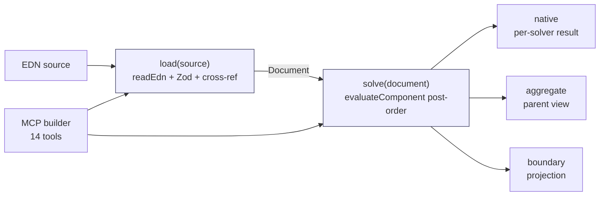

# argdown-2

A TypeScript library and MCP server for loading, validating, and solving argument graphs represented in [EDN](https://github.com/edn-format/edn). Six solvers. Nested solver composition. The library never throws and never produces a partial document.

> `0.2.0-alpha4` is a breaking pre-1.0 reset from `0.1.0-alpha1`. The custom `.argdown` parser, source AST, Mermaid renderer, CLI, and 15-solver surface are gone. A builder MCP server replaces the old custom-language MCP. See [CHANGELOG.md](CHANGELOG.md) for history.

## What is EDN?

EDN is a Clojure-origin data notation that maps directly to JS values. Keywords start with `:`, tagged literals with `#`, vectors with `[]`, maps with `{}`. It is the canonical source format for `argdown-2`.

## Quick start

```ts
import { Effect } from "effect";
import { load, solve } from "jsr:@casualtheorics/argdown-2";

const result = Effect.runSync(
  Effect.match(load(`
  #casualtheorics.argdown2/document
  {:id :quick-start
   :root
   #casualtheorics.argdown2.solver/grounded
   {:id :root
    :interface
    {:aggregate
     #casualtheorics.argdown2.aggregate/identity
     {:inputs [{:ref :a}]}}
    :elements
    [#casualtheorics.argdown2.argdown/statement {:id :a :text "A"}
     #casualtheorics.argdown2.argdown/statement {:id :b :text "B"}
     #casualtheorics.argdown2.argdown/attack
     {:id :attack-a-b :from :a :to :b}]}}
`), {
    onFailure: (err) => ({
      ok: false as const,
      errors: err._tag === "RootCount" || err._tag === "ReadError"
        ? [err.diagnostic]
        : err.diagnostics,
    }),
    onSuccess: (document) => ({ ok: true as const, document }),
  }),
);

if (!result.ok) {
  console.error(result.errors);
} else {
  console.log(solve(result.document).native);
  // { kind: "labels", values: Map(2) { "a" => "in", "b" => "out" } }
}
```

`load`, `validate`, and `parseCandidate` return `Effect` values — unwrap at the edge with `Effect.match` + `Effect.runSync`. Failures are tagged (`EdnError` | `SchemaError` | `ValidateError`); the library never throws and never produces a partial document on failure.

Three install paths:

| You want to... | Use this |
| --- | --- |
| Use the library from Deno | `deno add jsr:@casualtheorics/argdown-2` |
| Run the MCP server in any MCP client | `bash scripts/argdown-2-mcp` (downloads the pinned native binary) |
| Install in Claude Code | `/plugin marketplace add kellenff/argdown-2` then `/plugin install argdown-2@argdown-2` |

## Status and rigor

Seven EDN fixtures in `src/bench.fixtures/` are exercised by every commit: `small-minimal`, `small-relations`, `small-argument`, `medium-censorship`, `heavy-attacks`, `deep-arguments`, `large-stress`. [`examples/argdown1-censorship.edn`](examples/argdown1-censorship.edn) ports the [Argdown 1.x censorship tutorial](https://argdown.org/guide/a-first-example.html); [`src/parity.test.ts`](src/parity.test.ts) verifies that the grounded labels match the pure-attack expected set.

## Architecture


```mermaid
flowchart LR
  src["EDN source"] --> load["load(source)<br/>readEdn + Zod + cross-ref"]
  load -->|Document| solve["solve(document)<br/>evaluateComponent post-order"]
  solve --> native["native<br/>per-solver result"]
  solve --> aggregate["aggregate<br/>parent view"]
  solve --> boundary["boundary<br/>projection"]

  mcp["MCP builder<br/>14 tools"] --> load
  mcp --> solve

  classDef pure fill:#eef,stroke:#446
  class load,solve pure
```

The library runs as a three-stage data pipeline:

1. `load(source)` parses the EDN source into a raw value via [`edn-parser-js`](https://www.npmjs.com/package/edn-parser-js).
2. `validate(value)` decodes the document and recursively checks each component's local endpoint scope, interface selection, relation identity, and child import compatibility.
3. `solve(document)` folds the component tree post-order. Each component returns `native`, `aggregate`, and `boundary` layers; a parent sees only each child's boundary confidence.

Because EDN maps directly to JS data, syntax and cross-reference validation collapse into a single pipeline. The custom parser, AST, and visitor split from `0.1.0` is no longer present in `0.2.0`.

The MCP server is a co-equal layer above this pipeline. It registers 14 tools that call `load`, `validate`, `solve`, and the builder functions directly. There is no separate code path; an agent-constructed graph goes through the same validation and solver as a programmatic one.

## Solver

`solve` dispatches on each component's solver tag:

| Root tag | Result | Support handling |
| --- | --- | --- |
| `#…/solver/grounded` | labels | rejected at validation |
| `#…/solver/bipolar` | labels | deductive reduction (`B → sup:A→B → A`) |
| `#…/solver/evidential` | labels | necessary reduction (`A → nec:A→B → B`) |
| `#…/solver/preferred` | extensions | rejected at validation |
| `#…/solver/stable` | extensions | rejected at validation |
| `#…/solver/complete` | extensions | rejected at validation |

Grounded labeling is Dung's grounded semantics: the smallest complete extension containing all unattacked arguments and all arguments recursively defended by them. Anything attacked by an IN argument is OUT. Arguments that survive in un-attacked odd cycles or self-attack are UNDEC.

Each solver declares the relation kinds it consumes. Unsupported kinds fail validation with `semantic/unsupported-relation-kind` (and the builder refuses them early with `builder/unsupported-relation-kind`). Current consumers: grounded / preferred / stable / complete accept `attack` and `contradiction`; bipolar / evidential also accept `support`. No current solver consumes `undercut`.

| Solver | a | b | c |
| --- | --- | --- | --- |
| bipolar | out | in | in |
| evidential | out | out | in |

Evidential propagates A's defeat to B (necessary support). Bipolar does not (deductive support protects the supporter instead).

## First-class solver components

A solver is an identified element in its parent's local scope. Child internals remain private, but the child ID is a valid parent relation endpoint. Evaluation is strictly bottom-up, so parent relations cannot feed state back into a child.

```edn
#casualtheorics.argdown2/document
{:id :nested-example
 :root
 #casualtheorics.argdown2.solver/grounded
 {:id :root
  :interface {:aggregate #casualtheorics.argdown2.aggregate/identity
              {:inputs [{:ref :target}]}}
  :elements
  [#casualtheorics.argdown2.argdown/statement {:id :target}
   #casualtheorics.argdown2.solver/grounded
   {:id :child
    :interface {:aggregate #casualtheorics.argdown2.aggregate/identity
                {:inputs [{:ref :claim}]}}
    :elements
    [#casualtheorics.argdown2.argdown/statement {:id :claim}]}
   #casualtheorics.argdown2.argdown/attack
   {:id :child-attacks-target :from :child :to :target}]}}
```

`solve(document).native` is per-solver. `.aggregate` is the parent's view. `.boundary` is the typed confidence projection. `.children` is the per-child evaluation record. `.warnings` collects non-fatal diagnostics. Grounded boundaries map `IN` to `1`, `OUT` to `0`, and `UNDEC` to `nil`. Grounded parents import these as ordinary, intrinsically defeated, or self-attacking proxy nodes. See the [data design](docs/snowball/specs/2026-07-19-first-class-solver-components-design.md) and [formal companion](docs/snowball/specs/2026-07-19-first-class-solver-components-category-theory.md).

## MCP server

Fourteen tools, stdio transport, single binary `argdown-2-mcp`. Every mutating tool takes exactly one of `path` (filesystem `.edn`, atomic write via temp + rename) or `source` (full document text, returns updated text). Optional `parentId` scopes mutations to a nested solver component (default: document root). Builder mutations may soft-warn (`builder/unresolved-ref`); `builder/duplicate-id`, `builder/missing-id`, and `builder/unsupported-relation-kind` refuse the edit and return a `refused` field with no document change.

| Tool | Purpose |
| --- | --- |
| `create_document` | Create an empty document (optional solver tag; default grounded) |
| `add_statement` | Add a statement (id + optional prose text) |
| `update_statement` | Update an existing statement by id |
| `add_argument` | Add an argument (id + optional description) |
| `add_inference` | Add an inference under an argument; premises and conclusion accept id or prose |
| `add_relation` | Add an identified relation kind consumed by the target solver |
| `add_solver` | Add an empty child solver under `parentId` |
| `set_import` | Set a threshold projection for an immediate child boundary |
| `remove_import` | Remove a parent import projection |
| `remove_element` | Remove a statement, argument, inference, or child solver by id |
| `remove_relation` | Remove a relation by ID |
| `list_elements` | List statements, arguments, inferences, relations, and nested solvers |
| `validate` | Strict-load and return semantic diagnostics |
| `solve` | Strict-load and compute component-native, aggregate, and boundary results |

### Claude Code plugin (one-click install)

This repo is a Claude Code marketplace. Installing the `argdown-2` plugin registers the MCP server and ships skills for prose extraction / interactive argument building / build / validate / solve (`prose-to-argdown-2`, `interactive-argument`, `build-graph`, `validate-debug`, `interpret-solve`).

1. In Claude Code: `/plugin marketplace add kellenff/argdown-2` (or add a local checkout path).
2. `/plugin install argdown-2@argdown-2`
3. Enable the plugin if prompted. MCP starts via the checked-in binary launcher.

**Never hand-edit EDN** while using the plugin. Mutate graphs only through the builder MCP tools (`create_document`, `add_statement`, ...).

Optional checks after changing plugin files:

```bash
claude plugin validate .
claude plugin validate ./plugins/argdown-2
```

The plugin launches the server with `bash ${CLAUDE_PLUGIN_ROOT}/scripts/argdown-2-mcp` (launcher + version pin are copied under `plugins/argdown-2/scripts/`). The version is pinned in [`scripts/argdown-2-mcp.version`](scripts/argdown-2-mcp.version). From a source clone of this repo, run `deno task mcp` for stdio MCP from TypeScript.

Release binaries are compiled directly from [`src/mcp/cli.ts`](src/mcp/cli.ts) with `deno task compile:mcp` / [`scripts/compile-mcp.sh`](scripts/compile-mcp.sh); there is no separate MCP bundler.

### Pi coding agent

Install from git (unix only — the launcher is bash):

```bash
pi install git:github.com/kellenff/argdown-2
```

Or from a local clone: `pi install /absolute/path/to/argdown-2`.

This loads the shared skills under `plugins/argdown-2/skills` and a Pi extension that bridges the stdio MCP server (same `scripts/argdown-2-mcp` binary launcher). No `pi-mcp-adapter` / `.mcp.json` is required for argdown-2 tools.

**Never hand-edit EDN** — use the builder MCP tools only.

### Claude Desktop and other MCP clients

For [`claude_desktop_config.json`](https://docs.claude.com/en/docs/claude-desktop/mcp) or any MCP client via the root [`mcp.json`](mcp.json):

```json
{
  "mcpServers": {
    "argdown-2": {
      "command": "bash",
      "args": ["scripts/argdown-2-mcp"]
    }
  }
}
```

Call `validate` before `solve` when you need a hard gate on incremental authoring.

## Canonical EDN shape

One file contains a `#casualtheorics.argdown2/document` map with `:id` and an identified `:root` solver map. Solver maps contain `:id`, `:interface`, optional `:imports`, and an `:elements` vector.

| Tag | Purpose |
| --- | --- |
| `#casualtheorics.argdown2.solver/grounded` | Grounded labels; support rejected |
| `#casualtheorics.argdown2.solver/bipolar` | Grounded labels; deductive support reduction |
| `#casualtheorics.argdown2.solver/evidential` | Grounded labels; necessary support reduction |
| `#casualtheorics.argdown2.solver/preferred` | Preferred extensions (pure-attack) |
| `#casualtheorics.argdown2.solver/stable` | Stable extensions (pure-attack) |
| `#casualtheorics.argdown2.solver/complete` | Complete extensions (pure-attack) |
| `#casualtheorics.argdown2.argdown/statement` | Declare a statement node |
| `#casualtheorics.argdown2.argdown/argument` | Declare an argument and optional inferences |
| `#casualtheorics.argdown2.argdown/inference` | Link statement premises to a statement conclusion |
| `#casualtheorics.argdown2.argdown/support` | Support; valid under bipolar / evidential only |
| `#casualtheorics.argdown2.argdown/attack` | Add one directed Dung attack |
| `#casualtheorics.argdown2.argdown/contradiction` | Add attacks in both directions |
| `#casualtheorics.argdown2.argdown/undercut` | Target an inference or relation; rejected by all current solvers |

IDs and references are EDN keywords. IDs are unique within one solver component across statements, arguments, inferences, relations, and immediate child solvers. Sibling components may reuse local IDs.

## Validation

`load(source)` performs three checks in order: strict EDN parsing, Zod schema validation of tagged values and fields, and identity, reference, and endpoint validation. On failure the Effect fails with a tagged error carrying diagnostics (semantic paths like `[2, ':inferences', 0, ':premises', 3]`). A malformed document never produces a partial document.

Use `validate(value)` when EDN has already been read with `edn-parser-js` and you only need the schema and semantic checks. Use `parseCandidate(source)` when you want wire decode only (no semantic validation).

## Project status

What is here: strict EDN loader, Zod schema validation, cross-reference validator, six label solvers (grounded, bipolar, evidential) and three multi-extension solvers (preferred, stable, complete), first-class nested solver composition, builder MCP server, atomic-write I/O layer, Claude Code plugin marketplace, GitHub Actions CI and release workflows.

What is not here: a custom `.argdown` language or parser, a source AST, a Mermaid or DOT renderer, a CLI binary (the MCP server is the only shipped binary), ASPIC+ or CLS 2013 full evidential labeling, a public license (the license will be chosen before the first public release).

Distribution: the library is published to [JSR](https://jsr.io/@casualtheorics/argdown-2) (`jsr:@casualtheorics/argdown-2`); every merge to `main` publishes a `*-dev.{utcTimestamp}` prerelease. Native MCP binaries ship via GitHub Releases (`.github/workflows/release.yml`).

The namespaced EDN theory tags are spec-frozen. New solver roots (such as evidential) are additive via `SOLVER_TAGS`. Downstream consumers cannot invent theory tags without forking. This is a deliberate scoping decision.

## Install (library)

```bash
deno add jsr:@casualtheorics/argdown-2
```

```ts
import { load, solve } from "jsr:@casualtheorics/argdown-2";
```

## MCP (consumers)

Use the checked-in launcher (`bash scripts/argdown-2-mcp`) which downloads the pinned native binary from GitHub Releases. No Deno or Node required on the consumer machine.

## CLI

The `argdown-2` binary (`deno task cli`) reads an EDN file, runs the per-component solver, and renders the result. The bare invocation solves; `--dry-run` validates; the new `solve` and `validate` subcommands are explicit synonyms.

```bash
argdown-2 foo.edn                              # solve, table output
argdown-2 --format=dot foo.edn > foo.dot       # solve, Graphviz DOT
argdown-2 --dry-run foo.edn                    # validate only
argdown-2 validate foo.edn                     # subcommand synonym
argdown-2 solve --format=json foo.edn          # subcommand synonym
cat foo.edn | argdown-2 -                      # stdin
```

Exit codes: `0` success, `1` parse/validation/solve error, `2` usage error. See `argdown-2 --help` for the full surface.

## Development

Requires Deno matching [`scripts/deno-version`](scripts/deno-version).

```bash
deno task test
deno task check
deno task publish:dry-run
deno task lint
deno task fmt:check
deno task mcp              # stdio MCP from source
deno task compile:mcp      # host native binary
deno task check:mcp-deno
deno task probe:mcp -- ./dist/mcp-bin/argdown-2-mcp-<host>
```

PR-time validation runs in `.github/workflows/ci.yml`; release-time runs in `.github/workflows/release.yml`. The two share the same gates.

## License

Private. The license will be chosen before the first public release.
