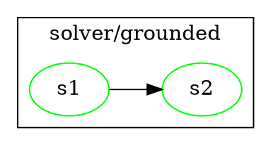
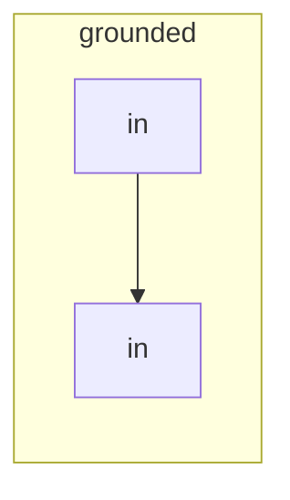

# argdown-2 CLI — Design Spec

**Status:** Draft. Under brainstorming review.
**Date:** 2026-07-21

## Context

The argdown-2 project previously shipped a CLI surface, but the
0.2.0-alpha1 reset (2026-07-17) explicitly removed it as part of the
"library-only public surface" decision. The current shipped artifacts are:

- The `@casualtheorics/argdown-2` library (`load`, `validate`, `solve` only)
- The `argdown-2-mcp` MCP stdio server (for LLM hosts)
- The Pi coding-agent package (MCP bridge for the pi agent)
- The Claude Code marketplace plugin (MCP + skills)

The 0.2.0-alpha1 changelog entry makes the removal explicit:

> "Removed — Custom `.argdown` lexer, parser, source AST, stringifier, CLI,
> MCP server, and Mermaid renderer."

The project ADR records the philosophy as "YAGNI, explicitly. Keep only
capabilities required for the EDN+grounded contract." and
"Library-only surface."

This spec reintroduces a CLI surface as a **deliberate expansion** of that
philosophy — not a continuation. The motivation: users want shell access to
the load/validate/solve pipeline without going through an LLM host. The MCP
server is not a substitute for "I just want to check if this file parses."

## Goal

Ship an `argdown-2` binary that lets users and shell scripts:

1. **Validate** an EDN document (parse + semantic check)
2. **Solve** an EDN document (compute acceptance labels per the document's
   per-component solver tags)
3. **Render** the result in a chosen format (table, DOT, Mermaid, JSON)

…without going through the MCP stdio server or an LLM host.

## Non-goals

- **A new `.argdown` parser.** The parser was planned
  (`2026-06-21-argdown-typescript-parser-design.md`) but never shipped;
  `src/parser.ts` does not exist on disk. EDN-only input.
- **A CLI flag for solver semantics.** Semantics come from the document's
  per-component solver tags
  (`#casualtheorics.argdown2.solver/grounded`, `.../bipolar`,
  `.../evidential`, etc.). No `--semantics` flag.
- **Backward compatibility** with the legacy subcommand-based `argdown` CLI
  (was removed in 0.2.0-alpha1; no shim).
- **Subcommands.** Single binary, flag-driven. (See "Why no subcommands" in
  Trade-offs.)
- **Interactive REPL, completion scripts, config files.**
- **Direct MCP protocol invocation from the CLI.** The MCP server is a
  separate binary with its own distribution surface.

## Approach: flag-driven single binary

A single binary `argdown-2` with no subcommands. The default action is
"solve". Validation is a short-circuit via `--dry-run`. Output format is
selectable via `--format`. This is closer to standard Unix tooling
(`cat`, `jq`, `sed`) than to a subcommand-based CLI.

### Flag surface

| Flag | Effect |
|---|---|
| `<path\|->` (positional) | EDN file path, or `-` for stdin. Required. |
| `--format=<table\|dot\|mermaid\|json>` | Output format (default: `table`). |
| `--dry-run` | Validate only; skip solve and render. Silent on success. |
| `--quiet` | Suppress diagnostics on stderr (still non-zero exit on errors). |
| `--help` | Print usage to stdout, exit 0. |
| `--version` | Print version to stdout, exit 0. |

Defaults: `argdown-2 foo.edn` = load + solve + table.
`argdown-2 -` = same, reading from stdin.

### Library access

Direct imports, not JSON-RPC to the MCP server:

```ts
import { load, validate, solve } from "../index.js";
import type { Document } from "../model.js";
```

This is what "separate command surface" means in practice — same library,
different entry point. The MCP server remains its own binary.

### File layout

```
src/cli.ts                  # bin entry: argv parser + dispatcher
src/cli/help.ts             # HELP text, VERSION
src/cli/input.ts            # read stdin or file path
src/cli/load.ts             # load + parse-error reporting
src/cli/solve.ts            # default action: load + solve
src/cli/format.ts           # format dispatch
src/cli/format-table.ts     # markdown-flavored, per-solver headings
src/cli/format-json.ts      # EDN-shaped JSON with labels threaded through
src/cli/format-dot.ts       # DOT with nested subgraphs per solver
src/cli/format-mermaid.ts   # Mermaid with nested subgraphs per solver
src/cli/validate.ts         # --dry-run mode
src/cli/output.ts           # stdout/stderr/exit helpers
src/cli/*.test.ts
src/cli/__snapshots__/
```

## Output formats

### Table (default, markdown-flavored)

**Single-semantics document:**

```markdown
## IN

- [#s1] The sky is blue.
- [#s2] Therefore it is daytime.

## OUT

- [#s3] It is nighttime.

## UNDETERMINED

- [#s4] It might be twilight.
```

**Mixed-semantics document** (per-solver headings, with IN/OUT/UNDETERMINED
nested under each solver component):

```markdown
## solver/grounded

### IN

- [#s1] The sky is blue.

### OUT

- [#s3] It is nighttime.

## solver/bipolar

### UNDETERMINED

- [#s4] It might be twilight.
```

Empty groups are omitted. Each statement gets `- [#id] :text` on one line
(text from the document's `:text` field).

### JSON (`--format=json`)

Mirrors the EDN document structure with labels threaded through. Each
statement carries its `label`; each solver root has a `labels` map; relations
are structural (no label). The document's overall shape (id, root, elements)
is preserved.

**Single-semantics document:**

```json
{
  "id": "quick-start",
  "root": {
    "id": "root",
    "solver": "grounded",
    "labels": { "a": "in", "b": "out" },
    "elements": [
      { "kind": "statement", "id": "a", "text": "A", "label": "in" },
      { "kind": "statement", "id": "b", "text": "B", "label": "out" },
      { "kind": "attack", "id": "attack-a-b", "from": "a", "to": "b" }
    ]
  },
  "diagnostics": [],
  "warnings": []
}
```

**Mixed-semantics document** (`root` becomes a tree of solver components):

```json
{
  "id": "doc",
  "root": {
    "id": "outer",
    "solver": "grounded",
    "labels": { "a": "in" },
    "elements": [...],
    "children": [
      {
        "id": "inner",
        "solver": "bipolar",
        "labels": { "x": "undetermined" },
        "elements": [...]
      }
    ]
  }
}
```

### DOT (`--format=dot`)

Render the solver tree as nested subgraphs. Each statement node gets color
by label:



### Mermaid (`--format=mermaid`)

Same nested structure with subgraphs:



## Data flow

```
<file or stdin>
      │
      ▼
   load(source)        ──►  !ok → parse errors → stderr, exit 1
      │ ok
      ▼ Document
   ┌──┴─────────────────────────┐
   ▼                            ▼
--dry-run?                  solve(doc)
   │                            │
   ▼                            ▼
validate(doc)            ComponentSolveResult
   │                            │
   ▼                            ▼
exit 0/1 silent           format dispatch
                                 │
                    ┌────────────┼───────────┬──────────┐
                    ▼            ▼           ▼          ▼
                  table         json         dot      mermaid
                    │            │           │          │
                    └────────────┴───────────┴──────────┘
                                  │
                                  ▼
                               stdout
```

## Error handling

| Failure | Stream | Exit |
|---|---|---|
| `--dry-run` success | (silent) | 0 |
| `--dry-run` failure | stderr | 1 |
| Parse error | stderr | 1 |
| Validation error | stderr | 1 |
| Solve error | stderr | 1 |
| Usage error (unknown flag, missing path) | stderr | 2 |
| `--help`, `--version` | stdout | 0 |
| `--quiet` | (suppress stderr) | (same exit) |

Diagnostic format: error code (e.g., `schema/missing-required`,
`semantic/duplicate-id`, `semantic/missing-reference`,
`semantic/non-selectable-endpoint`,
`semantic/unsupported-relation-kind`) + human-readable message.
`--format=json` makes diagnostics machine-parseable (top-level
`diagnostics[]` field in the output object).

## Distribution

Mirrors the existing `argdown-2-mcp` distribution pattern (per
`scripts/argdown-2-mcp` + `scripts/argdown-2-mcp.version`):

1. **Compiled native binary** via `bash scripts/argdown-2` launcher, version
   pinned in `scripts/argdown-2.version`. The launcher downloads (or reuses)
   a pinned binary from GitHub Releases. Works without Deno installed.
2. **npm bin** via `"bin"` field in the existing `@casualtheorics/argdown-2`
   package. Requires Node.js.
3. **Deno install** via `deno install -A -n argdown-2 ...`. Requires Deno.

The MCP launcher pattern (`scripts/argdown-2-mcp` + a synced copy in
`plugins/argdown-2/scripts/`) is enforced by `src/claude-plugin.test.ts`;
the CLI launcher follows the same template with a separate
`scripts/argdown-2-mcp` analog.

## Testing

- **Unit tests per formatter** (`format-table.test.ts`, `format-json.test.ts`,
  `format-dot.test.ts`, `format-mermaid.test.ts`) on fixture
  `ComponentSolveResult` and fixture documents.
- **Integration tests** via `Deno.Command` (per command path) on fixture EDN
  files; assert stdout, stderr, exit code for each flag combination.
- **Snapshot tests** in `src/cli/__snapshots__/` for each command path + each
  format + each document fixture.
- **Mixed-semantics fixtures** required: at least one parent (e.g.,
  grounded) + child (e.g., bipolar) document tested for all 4 formatters.
- **All 7 EDN bench fixtures** in `src/bench.fixtures/` (small-minimal,
  small-relations, small-argument, medium-censorship, heavy-attacks,
  deep-arguments, large-stress) must round-trip through the CLI without
  error.
- **MCP parity test**: same input via CLI vs. via MCP `solve` tool produces
  the same JSON output.

## Trade-offs

### Why a CLI now (departure from library-only)

The 0.2.0-alpha1 reset explicitly removed the CLI as part of "library-only
public surface" + "YAGNI, explicitly". This spec reintroduces it because:

- Users want shell access to validate/solve without going through an LLM
  host.
- The 14-tool MCP server is LLM-oriented, not shell-oriented (tool
  descriptions, structured errors, JSON-RPC overhead).
- The library surface (`load`, `validate`, `solve`) is stable enough that a
  thin wrapper does not add meaningful maintenance burden.
- Direct library access from the CLI is the same code path MCP uses
  internally — no behavior drift.

The spec calls this out explicitly so future readers know the CLI is a
conscious expansion, not a reintroduction of the removed surface.

### Why no subcommands

The original `argdown` design (per `CHANGELOG.md` history and prior
`.agent_memory.json`) had subcommands: `render`, `solve`, `ast`, `validate`,
`format`, `mcp`. This spec uses flags instead because:

- The user explicitly pivoted away from subcommands during brainstorming.
- Flag-driven is closer to standard Unix tooling (`cat`, `jq`, `sed`).
- Three actions (default=solve, `--dry-run`=validate, `--format=X`=render)
  do not justify the dispatch overhead of subcommands.
- Solver semantics live in the document, so the CLI has no per-solver
  commands to dispatch to.

### Why semantics come from the document

The CLI does **not** expose `--semantics` because:

- Semantics are intrinsic to the document (per-component solver tags
  `#casualtheorics.argdown2.solver/...`). The library dispatches internally
  via `src/component-eval.ts`.
- Adding a CLI-level override would duplicate the document's control
  surface.
- Mixed-semantics documents (nested solver components) require per-component
  dispatch that no CLI flag could express.
- The CLI is a thin wrapper; the library's solver dispatch is already
  correct for all 6 solvers (grounded, bipolar, evidential, complete,
  preferred, stable per `src/model.ts`).

### Why direct library imports (not via MCP)

The MCP stdio server is a separate binary. The CLI does not spawn it because:

- Spawning a subprocess per CLI invocation adds latency (process + JSON-RPC).
- The MCP protocol is LLM-oriented (tool descriptions, structured errors),
  not CLI-oriented.
- Direct imports are simpler — same library, different entry point.
- Behavior parity is enforced by the MCP parity test, not by shared code.

### Why 3 distribution channels

- Compiled binary: end users without Deno/Node.
- npm bin: Node.js consumers.
- Deno install: Deno consumers.

This mirrors the existing `argdown-2-mcp` distribution pattern (per
`scripts/argdown-2-mcp` and the parallel `argdown-2-mcp.version` pin).

### Why EDN-only input

The `.argdown` parser was planned but never shipped. AGENTS.md makes the
constraint explicit: "Never hand-edit EDN; use builder MCP tools." Adding a
parser is a separate project (new spec + plan + implementation cycle). The
CLI ships on top of what's already in the repo.

## Open / Future

- **`--format=tsv`** (tab-separated values, awk-friendly) if users want a
  machine-parseable text format. Deferred — current sectioned table is
  awk-greppable via `awk '/^## IN/,/^## /'`.
- **`--bail-on-warnings` / `--strict`** flags for CI integration. Deferred.
- **Schema version negotiation** (when the EDN schema evolves). Deferred.
- **A `.argdown` text source CLI** would require shipping the missing parser
  first. Out of scope for this spec.
- **Document-level solver defaults** via `defaults` map (if the schema ever
  adds one). The CLI would surface them via `--semantics` only if the
  library adds document-level solver defaults; otherwise the flag has no
  meaning and stays out.

## Spec self-review

- ✅ No placeholders, TODOs, or TBDs.
- ✅ Internal consistency: flag surface, file layout, data flow, error
  table, and trade-offs all reference the same commands and formats.
- ✅ Scope: a single CLI binary with 3 distribution channels. Fits in one
  implementation plan.
- ✅ Ambiguity: per-solver table headings (Option A vs B) and JSON shape
  resolved during brainstorming; recorded above.
- ✅ Departure from library-only philosophy flagged explicitly (per Context
  + Trade-offs sections) so future readers know this is a conscious
  expansion, not a reversal.