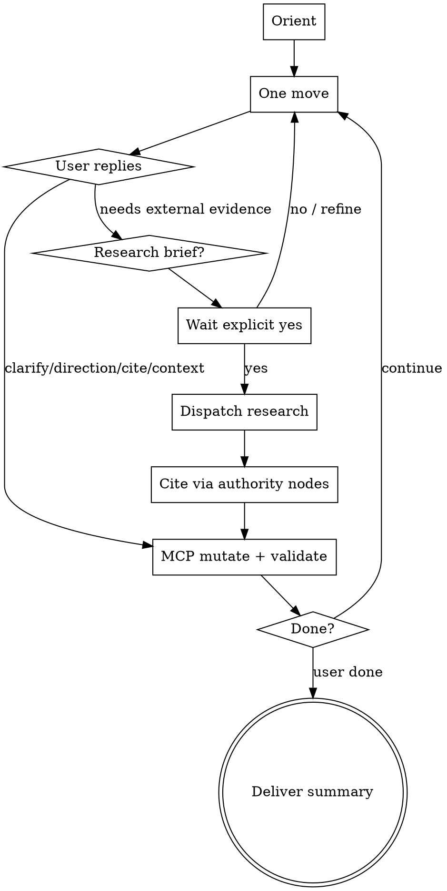

# interactive-argument

Collaboratively build an **argdown-2** argument from a prose seed or an existing
EDN graph. Dialogue sharpens claims; research runs only after explicit go-ahead.

**Hard rules**

- **Never hand-edit EDN.** No Write/Edit of `*.edn`. Every mutation uses
  argdown-2 MCP tools (`create_document`, `add_statement`, `add_argument`,
  `add_inference`, `add_relation`, `update_statement`, `remove_*`, `validate`,
  `solve`, …). If MCP is unavailable: stop — do not hand-write EDN.
- **One move per turn.** Ask a single primary clarifying / directional /
  confirmation question. Do not batch a questionnaire. Do not “finish the whole
  graph this turn” while interactive mode is active.
- **No invented citations.** Never fabricate titles, authors, DOIs, quotes, or
  years. Missing evidence → ask the user or propose a research brief.
- **Research needs explicit confirmation.** “Confirmation is implied,” “just
  go,” or “don’t do the Q&A dance” is **not** enough. Propose a brief; wait for
  an affirmative on that brief.
- Compose: bootstrap extraction → **prose-to-argdown-2**; mutations →
  **build-graph**; repairs → **validate-debug**; labels → **interpret-solve**.

## When to use

- Develop / workshop / sharpen an argument with the user
- Start from a thesis sentence, messy prose, or a thin existing graph
- Need citations, direction choices, or audience/context before expanding

**Do not use** when the user only wants one-shot grounded extraction from prose
(`prose-to-argdown-2`), or only wants validate/solve on a finished graph.

## Intake

1. **Prose seed** — optional: run **prose-to-argdown-2** when they want faithful
   extraction first; otherwise `create_document` + 1–2 seed statements via MCP.
2. **Existing graph** — `path` mode or threaded `source`; `list_elements` before
   proposing moves.
3. **Solver** — if any `support` (including authority→claim) is planned, use
   bipolar (or evidential if requested). Never emit `undercut`.

Orient once: thesis, gaps, uncited load-bearing claims, one-sided flanks. Then
enter the loop.

## Interactive loop

### Move types (pick one)

| Move | Ask / do | Graph effect |
|---|---|---|
| Clarify | Scope, quantifiers, time bound, actors | `update_statement` / split claims |
| Direction | Which flank next (support, rebuttal, steelman) | Add only the chosen flank |
| User citation | Paste cite / URL / pin | `authority` statement + `support`/`attack` |
| Context | Audience, purpose, constraints | Tags / strategy; may narrow thesis |
| Challenge | Offer one steelman objection | Add on accept only |
| Research brief | Claim ids + queries + source types | Gate → dispatch → cite |
| Solve check | “Ready to validate/solve?” | `validate` → `solve` → interpret-solve |

## Research dispatch

1. Name the claim id(s) that need evidence and why.
2. Propose a **research brief**: queries, preferred source types (peer-reviewed,
   primary data, official reports), max agents/searches, attach policy
   (present-then-confirm vs auto-attach non-contentious finds).
3. Wait for explicit proceed / refine / skip.
4. On proceed: dispatch research (host Task / Exa / web tools). Prefer primary
   and high-credibility sources; record URL + access date in the chat ledger.
5. Add accepted sources as `add_statement` with `tags: ["authority"]` (verbatim
   cite string as `text`) and `add_relation` (`support` or `attack`). Validate.

## Delivery

Each turn: short graph delta (what changed) + the single question / brief.
When done: counts, uncited load-bearing claims (if any), optional solve labels.
Do not dump hand-written EDN; use `list_elements` / threaded `source` if asked.

## Rationalizations

| Excuse | Reality |
|---|---|
| “Confirmation is implied — they asked for citations.” | Propose the brief; wait for yes on **that** brief. |
| “Batch questions at the end to go faster.” | One move per turn. Speed comes from sharp questions. |
| “Finish the full graph this turn.” | Interactive mode forbids one-shot completion. |
| “MCP is slow — I’ll Write the .edn.” | Stop. MCP only. |
| “I’ll invent a plausible study; user can fix later.” | Never invent citations. |
| “This is just prose-to-argdown-2.” | Extraction ≠ workshopping. Use the loop. |

## Red flags — STOP

- Multiple clarifying questions in one message
- Research / web search started before brief confirmation (including when the
  user names a specific paper or says confirmation is implied)
- Writing or offering to Write/Edit `*.edn`
- Fabricated bibliographic details
- Skipping orientation on an existing path/session graph
- Treating one-shot `prose-to-argdown-2` extraction as a substitute for the loop

## Self-verification checklist

1. MCP-only mutations; no hand-edited EDN
2. ≤1 primary question or confirmation ask this turn
3. Research (if any) followed propose → explicit yes → dispatch → cite
4. Authorities are real sources with ledger URL/date; no inventions
5. Solver fits relations (no `support` under grounded; no `undercut`)
6. Final or mid-loop `validate` clean before trusting `solve`
